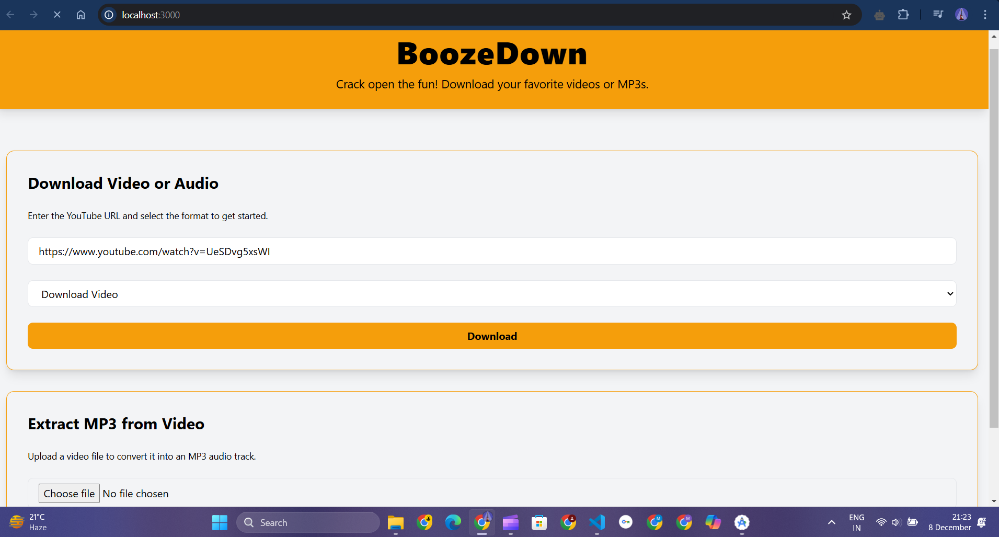

# BoozeDown

BoozeDown is a versatile tool designed for media processing. With BoozeDown, you can download videos or extract audio from YouTube URLs and uploaded video files effortlessly. Built with a simple API, BoozeDown leverages the powerful `yt-dlp` and Node.js for efficient performance. This project is optimized for local setups but can be expanded for deployment in production environments.

## Snapshots

---

## Features

1. **Download YouTube Videos and Audio**  
   - Supports downloading YouTube videos in MP4 format.  
   - Extracts high-quality audio from YouTube URLs in MP3 format.

2. **Extract Audio from Uploaded Videos**  
   - Upload your own video files to extract audio in MP3 format.  
   - Process is quick, reliable, and designed for a seamless user experience.

3. **Dynamic Output Management**  
   - Automatically saves output files to the `Downloads` directory on the user's machine.  
   - Files are served on the fly, followed by automatic cleanup of temporary files.

4. **Cross-Platform Adaptability**  
   - While configured for Windows, BoozeDown can be adapted to run on macOS or Linux systems with minor modifications.

5. **On-the-Fly Cleanup**  
   - Temporary files are automatically deleted after they are sent to the user, ensuring a clean workspace.

---

## Why Use Globally Installed `yt-dlp`?

BoozeDown relies on a globally installed `yt-dlp` for media processing. The reasons behind this decision include:

- **Up-to-Date Features**: A globally installed version ensures that you benefit from the latest updates, features, and bug fixes.  
- **Reduced Project Complexity**: By using `yt-dlp` globally, we minimize the need for complex dependencies within the project, making the setup process simpler.  
- **High Efficiency**: `yt-dlp` is a highly optimized tool for downloading and processing media, and using it globally ensures consistent performance across systems.

---

## Why Use `yt-dlp` Globally?

We opted for a global installation of `yt-dlp` for several reasons:

1. **Performance**: Installing `yt-dlp` globally ensures it's pre-compiled and ready to use, reducing overhead during runtime.
2. **Versatility**: `yt-dlp` is a powerful, community-maintained tool that supports various video platforms beyond YouTube, ensuring future scalability.
3. **Separation of Concerns**: By using it globally, the project avoids managing `yt-dlp` binaries directly, simplifying the codebase.
4. **Portability**: Users can easily reuse the global `yt-dlp` installation across other projects.

---

## Installation

Follow these steps to set up the project:

### Prerequisites

- **Node.js**: Ensure you have Node.js installed on your system.
- **Global Installation of `yt-dlp`**:  
  You need to install `yt-dlp` globally on your system.  

#### Installing `yt-dlp`
1. Install Python 3.7 or later if it's not already installed.  
   [Download Python](https://www.python.org/downloads/)

2. Install `yt-dlp` using Python's package manager `pip`:  
   ```bash
   pip install -U yt-dlp
3. Verify the installation:
   ```bash
   yt-dlp --version
     
### Clone the Repository
    git clone https://github.com/your-username/boozedown.git
    cd boozedown
### Install Dependencies
    npm install
## Running the Project
    npm run dev
### By default, the API will be accessible at `http://localhost:3000`.

## API Usage
### Download Video
Make a GET request to `/api/download` with the following parameters:
- `url`: The YouTube video URL.
- `format`: Optional. Use `audio` to download only the audio, or download the `video`.

## Contribution
### Contributions are welcome! To contribute:
1. Fork the repository.
2. Create a new branch:
   ```bash
   git checkout -b feature/your-feature-name
3. Commit your changes:
   ```
   git commit -m "Add your message here"
4. Push to the branch:
   ```
   git push origin feature/your-feature-name
5. Open a pull request.
